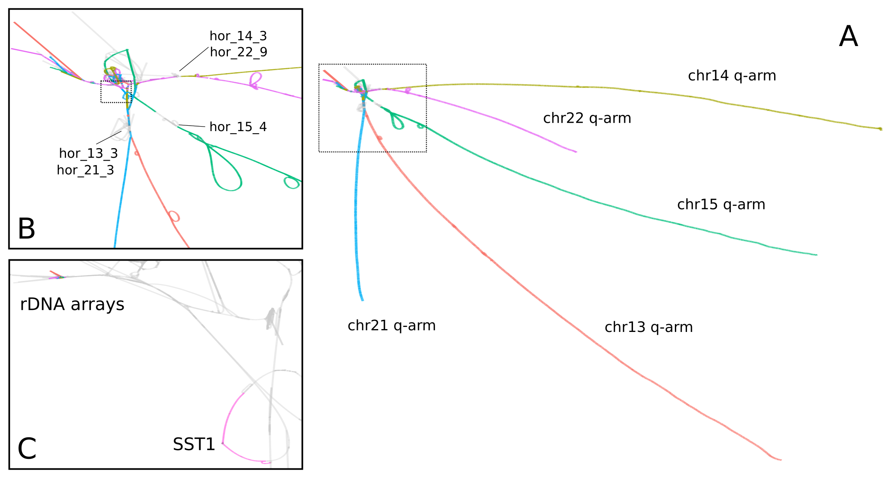
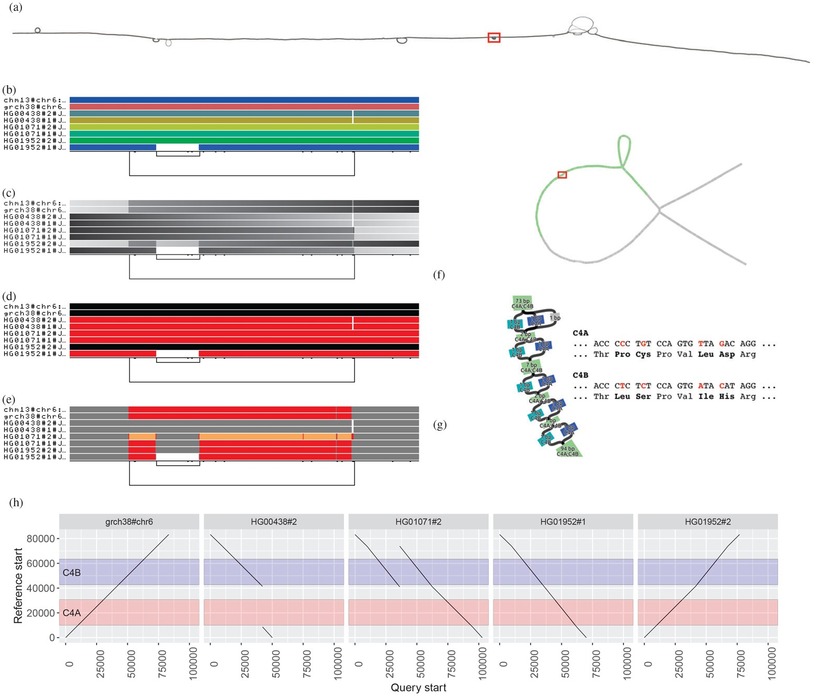

// Jan., Feb., Mar., Apr., May, June, July, Aug., Sept., Oct., Nov., Dec.

// Urls
:uri-twitter: https://twitter.com/AndresGuarahino
:uri-github: https://github.com/AndreaGuarracino
:uri-linkedin: https://www.linkedin.com/in/andreaguarracino
:uri-google-scholar: https://scholar.google.com/citations?user=zABbjIoAAAAJ
:uri-human-technopole: https://humantechnopole.it/en/
:uri-uthsc: https://www.uthsc.edu/
:uri-university-tor-vergata: http://web.uniroma2.it/
:uri-university-la-sapienza: https://www.uniroma1.it/
:uri-utrecht-bioinformatics-center: https://ubc.uu.nl/
:uri-unipavia-phdsgb: http://phdsgb.unipv.eu/site/en/home.html
:uri-university-salerno: https://web.unisa.it/en/home
:uri-iigm: https://www.iigm.it/
:uri-irccs: https://www.irccs.com/en
:uri-gisa: https://www.gisaitalia.net/
:uri-gisa-patent: https://it.espacenet.com/publicationDetails/biblio?II=0&ND=3&adjacent=true&locale=it_IT&FT=D&date=20171228&CC=IT&NR=UA20165252A1&KC=A1
:uri-human-genomics: https://humgenomics.biomedcentral.com/
:uri-plos-one: https://journals.plos.org/plosone/
:uri-gulbenkian-de-Ciencia: https://gulbenkian.pt/ciencia/
:uri-orcid: https://orcid.org/0000-0001-9744-131X
:uri-research-gate: https://www.researchgate.net/profile/Andrea-Guarracino
:uri-rincess-maxima-centrum: https://www.prinsesmaximacentrum.nl/en

// Talks / Posters
:uri-bog24: https://meetings.cshl.edu/meetings.aspx?meet=GENOME&year=24
:uri-github-bog24-poster-wfmash: https://andreaguarracino.github.io/posters/BoG24_AligningPangenomesWithHierarchicalWFA_Poster_AndreaGuarracino.pdf
:uri-sbme24: https://smbe2024.org/
:uri-sbme24-call-for-abstracts: https://andreaguarracino.github.io/images/SMBE24_CallForAbstracts_AndreaGuarracino.png
:uri-github-smbe24-certificate: https://andreaguarracino.github.io/certificates/SMBE24_CertificateOfAttendance_AndreaGuarracino.pdf
:uri-sbme23: https://www.smbe2023.org/
:uri-github-smbe23-poster-acrocentric: https://andreaguarracino.github.io/posters/SMBE23_RecombinationHeterologousAcrocentricChromosomes_Poster_AndreaGuarracino.pdf
:uri-github-smbe23-poster-rat: https://andreaguarracino.github.io/posters/SMBE23_BuildingPangenomeGraphRecombInbredRatStrainFamily_Poster_AndreaGuarracino.pdf
:uri-github-smbe23-certificate: https://andreaguarracino.github.io/certificates/SMBE23_CertificateOfAttendance_AndreaGuarracino.pdf
:uri-ctc-rg-2022: https://www.complextrait.org
:uri-ctc-rg-2023: https://complextrait.org/meetings/ctc-rg2023/program.html
:uri-h3abionet: https://www.h3abionet.org/
:uri-h3bionet-2023-material: https://github.com/AndreaGuarracino/ReferenceGraphPangenomeDataAnalysisHackathon2023
:uri-h3bionet-2023-inv-letter: https://github.com/AndreaGuarracino/andreaguarracino.github.io/blob/main/certificates/H3ABioNet2023_RefGraphInvitationLetter_AndreaGuarracino.pdf
:uri-ctc-rg-2023-certificate: https://andreaguarracino.github.io/certificates/CTCTG2023_CertificateOrganizerInstructor_AndreaGuarracino.pdf
:uri-github-ctc-rg-2022-abstract: https://andreaguarracino.github.io/abstracts/CTC_RG_2022_InitialEffortGenRatPangenome_Abstract_AndreaGuarracino.pdf
:uri-github-iggsy2024-presentation: https://andreaguarracino.github.io/presentations/IGGSy2024_TheCompleteSeqOfHumanRobChromosomes_Presentation_AndreaGuarracino.pdf
:uri-github-iggsy2022-presentation: https://andreaguarracino.github.io/presentations/IGGSy2022_ChromosomeCommunitiesHumanPangenome_Presentation_AndreaGuarracino.pdf
:uri-github-iggsy2022-grant-certificate: https://andreaguarracino.github.io/other/IGGSy2022_StudentTravelGrant_AndreaGuarracino.jpg
:uri-iggsy: https://iggsy.org/
:uri-3dbioinfo2021: https://elixir-europe.org/events/3d-bioinfo-2021-annual-meeting
:uri-3dbioinfo2021-abstract: https://andreaguarracino.github.io/abstracts/3DBioinfo2021_RNASecondaryStructMotifsInvolvedInTheInteractionWithRBPs_Abstract_AndreaGuarracino.pdf
:uri-biodiversitygenomics2021: https://enrolment.engage-powered.com/hinxtonhall/go/register.aspx
:uri-biodiversitygenomics2021-abstract: https://andreaguarracino.github.io/abstracts/BiodiversityGenomics2021_ChromosomeCommunitiesHumanPangenome_Abstract_AndreaGuarracino.pdf
:uri-biodiversitygenomics2021-presentation: https://andreaguarracino.github.io/presentations/BiodiversityGenomics2021_ChromosomeCommunitiesHumanPangenome_Presentation_AndreaGuarracino.pdf
:uri-agi2021congress: https://agi2021.centercongressi.com/programme.php
:uri-agi2021congress-abstract: https://andreaguarracino.github.io/abstracts/AGI2021_APangenomeForTheExpBXDfamOfMice_Abstract_AndreaGuarracino.pdf
:uri-agi2021congress-poster: https://andreaguarracino.github.io/posters/AGI2021_APangenomeForTheExpBXDfamOfMice_Poster_AndreaGuarracino.pdf
:uri-germanconferencebioinformatics2021: https://dechema.converia.de/frontend/index.php?folder_id=3138&page_id=
:uri-germanconferencebioinformatics2021-abstract: https://andreaguarracino.github.io/abstracts/GCB2021_ODGIScalableToolsForPangenomeGraphs_Abstract_AndreaGuarracino.pdf
:uri-germanconferencebioinformatics2021-presentation: https://andreaguarracino.github.io/presentations/GCB2021_ODGIScalableToolsForPangenomeGraphs_Presentation_AndreaGuarracino.pdf
:uri-eacr2021: https://www.eacr2021.org/
:uri-eacr2021-abstract: https://andreaguarracino.github.io/abstracts/EACR2021_ControlReplicationStressAndMitosisInCancerStemCells_Abstract_AndreaGuarracino.pdf
:uri-eacr2021-poster: https://andreaguarracino.github.io/posters/EACR2021_ControlReplicationStressAndMitosisInCancerStemCells_Poster_AndreaGuarracino.pdf
:uri-emblinitaly2021: http://www.embl-hamburg.de/aboutus/alumni/events-networks/local-chapters/italy/48_genoa_2021/index.html
:uri-emblinitaly2021-poster: https://andreaguarracino.github.io/posters/EMBLInItaly2021_IdentificationOfRNASeqAndStrMotifsForProteinInteraction_AndreaGuarracino.pdf
:uri-thebiologyofgenomes2021: https://meetings.cshl.edu/meetings.aspx?meet=GENOME&year=21
:uri-thebiologyofgenomes2021-abstract: https://andreaguarracino.github.io/abstracts/BoG2021_ThePangenomeGraphBuilder_Abstract_AndreaGuarracino.pdf
:uri-thebiologyofgenomes2021-poster: https://andreaguarracino.github.io/posters/BoG2021_ThePanGenomeGraphBuilder_Poster_AndreaGuarracino.pdf
:uri-bbcc2021: https://www.bbcc-meetings.it/program/
:uri-bbcc2021-abstract: https://andreaguarracino.github.io/abstracts/BBCC2020_PopulationGenomicsAnalysesOnPangenomeGraph_ProgramAndAbstractBook.pdf
:uri-bbcc2021-presentation: https://andreaguarracino.github.io/presentations/f1000research-326757.pdf
:uri-bbcc2021-presentation-f1000research: https://f1000research.com/slides/9-1338
:uri-vcbm2020: https://www.gcpr-vmv-vcbm-2020.uni-tuebingen.de/
:uri-vcbm2020-abstract: https://andreaguarracino.github.io/abstracts/EG_VCMB_GraphLayoutByPath-GuidedStochasticGradientDescent_Abstract_AndreaGuarracino.pdf
:uri-vcbm2020-poster: https://andreaguarracino.github.io/posters/EG_VCMB_GraphLayoutByPath-GuidedStochasticGradientDescent_Poster_Landscape_AndreaGuarracino.pdf
:uri-t2thprc2020: https://www.t2t-hprc-2020conference.com/
:uri-t2thprc2020-abstract-a: https://andreaguarracino.github.io/abstracts/T2T_HPRC_GraphLayoutByPath-GuidedStochasticGradientDescent_Abstract_AndreaGuarracino.pdf
:uri-t2thprc2020-poster-a: https://andreaguarracino.github.io/posters/T2T_HPRC_GraphLayoutByPath-GuidedStochasticGradientDescent_Poster_Portrait_AndreaGuarracino.pdf
:uri-t2thprc2020-abstract-b: https://andreaguarracino.github.io/abstracts/T2T_HPRC_ScalableVariantDetectionInPangenomeModels_Abstract_AndreaGuarracino.pdf
:uri-t2thprc2020-poster-b: https://andreaguarracino.github.io/posters/BBCC2020_ScalableVariantDetectionInPangenomeModels_Poster_AndreaGuarracino.pdf
:uri-t2thprc2020-blog: https://gsocgraph.blogspot.com/2020/08/final-week-recap-of-my-gsoc-experience.html
:uri-bcc2020: https://bcc2020.sched.com/
:uri-bcc2020-abstract: https://andreaguarracino.github.io/abstracts/BCC2020_COVID19_PubSeq_Abstract_AndreaGuarracino.pdf
:uri-bcc2020-poster: https://andreaguarracino.github.io/posters/BCC2020_COVID19_PubSeq_Poster_AndreaGuarracino.pdf
:uri-bcc2020-presentation: https://bcc2020.sched.com/event/coLw/covid-19-pubseq-public-sars-cov-2-sequence-resource
:uri-ismb2020: https://www.iscb.org/ismb2020
:uri-ismb2020-abstract-a: https://andreaguarracino.github.io/abstracts/ISMB2020_PantographBrowsablePangenomeVisualization_Abstract_AndreaGuarracino.pdf
:uri-ismb2020-poster-a: https://andreaguarracino.github.io/posters/ISMB2020_PantographBrowsablePangenomeVisualization_Poster_AndreaGuarracino.pdf
:uri-ismb2020-abstract-b: https://andreaguarracino.github.io/abstracts/ISMB2020_SemanticVariationGraphs_OntologiesForPangenomeGraphs_Abstract_AndreaGuarracino.pdf
:uri-ismb2020-poster-b: https://andreaguarracino.github.io/posters/ISMB2020_SemanticVariationGraphs_OntologiesForPangenomeGraphs_Poster_AndreaGuarracino.pdf
:uri-ismb2020-best-poster-prize: https://www.iscb.org/ismb2020-general/ismb2020-award-winners#bio-poster
:uri-ismb2020-citation: https://publikationen.bibliothek.kit.edu/1000127608
:uri-ismb2020-abstract-c: https://andreaguarracino.github.io/abstracts/ISMB2020_ComprehensiveAnalysisSARSCoV2_Abstract_AndreaGuarracino.pdf
:uri-ismb2020-poster-c: https://andreaguarracino.github.io/posters/ISMB2020_ComprehensiveAnalysisSARSCoV2_Poster_AndreaGuarracino.pdf

// Courses
:uri-lorentz-center: https://www.lorentzcenter.nl/
:uri-lorentz-center-epistasis-poster: https://github.com/AndreaGuarracino/andreaguarracino.github.io/blob/main/other/LorentzEpistatisWorkshop_AndreaGuarracino.pdf
:uri-enago-academy-academic-writing: https://www.enago.com/academy/how-to-overcome-challenges-in-academic-writing/
:uri-enago-academy-academic-writing-certificate: https://github.com/AndreaGuarracino/andreaguarracino.github.io/blob/main/certificates/ENAGO_CertificateOvercomingChallengesAcademicWriting_AndreaGuarracino.pdf
:uri-english-language-certification-certificate: https://github.com/AndreaGuarracino/andreaguarracino.github.io/blob/main/certificates/EnglishCertificateESOL_B2_CEFR_AndreaGuarracino.pdf
:uri-best-practices-RNA-seq: https://elixir-iib-training.github.io/website/2017/09/27/RNA-seq-Salerno.html
:uri-best-practices-RNA-seq-certificate: https://github.com/AndreaGuarracino/andreaguarracino.github.io/blob/main/certificates/ELIXIR_IIB_CertificateBestPracticesForRNAseqDataAnalysis_AndreaGuarracino.pdf
:uri-best-practices-RNA-seq-repository: https://github.com/ELIXIR-IIB-training/RNASeq2017

// Misc
:uri-hprc: https://humanpangenome.org/
:uri-hprc-collection: https://www.nature.com/collections/aebdjihcda
:uri-deciphering-complexity-neudeg-and-cacer-poster: https://github.com/AndreaGuarracino/andreaguarracino.github.io/blob/main/achievements/PhDWorkshop_DecipheringTheComplexityInNeurodegenAndCancer_Poster_AndreaGuarracino.pdf
:uri-google-summer-of-code: https://summerofcode.withgoogle.com/
:uri-google-summer-of-code-blog: https://gsocgraph.blogspot.com/2020/08/final-week-recap-of-my-gsoc-experience.html
:uri-lemonde-binaire: https://www.lemonde.fr/blog/binaire/
:uri-lemonde-binaire-article: https://www.lemonde.fr/blog/binaire/2020/05/06/sars-cov-2-et-covid-19-on-va-jouer-sur-les-mots/
:uri-seminar-invitation-tor-vergata-2023: https://github.com/AndreaGuarracino/andreaguarracino.github.io/blob/main/other/20230913_SeminarInvitationTorVergata_AndreaGuarracino.pdf
:uri-agi-simag-2023-invitation-speaker-letter: https://github.com/AndreaGuarracino/andreaguarracino.github.io/blob/main/other/20230606_AGI-SIMAG-2023_InvitationSpeakerLetter_AndreaGuarracino.pdf
:uri-agi-simag-2023-brochure: https://github.com/AndreaGuarracino/andreaguarracino.github.io/blob/main/other/AGI-SIMAG-2023_Brochure_AndreaGuarracino.pdf
:uri-joint-meeting-agi-simag-2023: https://www.associazionegeneticaitaliana.it/2023/05/14/joint-meeting-agi_simag-2023/
:uri-seminar-invitation-la-sapienza-2024: https://github.com/AndreaGuarracino/andreaguarracino.github.io/blob/main/other/20240226_InvitationLetterLaSapienza_AndreaGuarracino.pdf
:uri-seminar-brochure-la-sapienza-2024: https://github.com/AndreaGuarracino/andreaguarracino.github.io/blob/main/other/20240226_SeminarBrochureLaSapienza_AndreaGuarracino.pdf

// Universities, institutes
:human-technopole: {uri-human-technopole}[Human Technopole]
:uthsc: {uri-uthsc}[University of Tennessee Health and Science Center]
:university-tor-vergata: {uri-university-tor-vergata}[University of Rome Tor Vergata]
:utrecht-bioinformatics-center: {uri-utrecht-bioinformatics-center}[Utrecht Bioinformatics Center]
:unipavia-phdsgb: {uri-unipavia-phdsgb}[University of Pavia]
:university-salerno: {uri-university-salerno}[University of Salerno]
:iigm: {uri-iigm}[Italian Institute for Genomic Medicine]
:irccs: {uri-irccs}[Candiolo Cancer Institute]
:princess-maxima-centrum: {uri-rincess-maxima-centrum}[Princess Máxima Center for Pediatric Oncology]
:uri-semm: https://www.semm.it/curriculum/computational-biology
:university-semm: {uri-semm}[SEMM European School of Molecular Medicine]
:university-la-sapienza: {uri-university-la-sapienza}[University of Rome La Sapienza]

// Publications
:uri-pietrosanto-adinolfi-guarracino2021-rig: https://doi.org/10.1093/nargab/lqab007
:uri-guarracino2021-brio: https://doi.org/10.1093/nar/gkab400
:uri-guarracino2022-odgi: https://doi.org/10.1093/bioinformatics/btac308
:uri-musella2022: https://doi.org/10.1038/s41590-022-01290-3
:uri-pepe2022: https://doi.org/10.1016/j.ncrna.2022.01.003
:uri-guarracino2021-brio-webserver: http://brio.bio.uniroma2.it/
:uri-guarracino2021-brio-graphical-abstract: https://andreaguarracino.github.io/abstracts/BRIO_GraphicalAbstract_AndreaGuarracino.pdf
:uri-ferrarini2021: https://doi.org/10.1038/s42003-021-02095-0
:uri-mattiello2021: https://doi.org/10.3390/cancers13081957
:uri-novelli2021: https://doi.org/10.1038/s41419-021-03513-1
:uri-manic2021: https://doi.org/10.1038/s41418-020-00733-4
:uri-guarracino2022-acro-preprint: https://doi.org/10.1101/2022.08.15.504037
:uri-guarracino2023: https://doi.org/10.1038/s41586-023-05976-y
:uri-liao2022-preprint: https://doi.org/10.1101/2022.07.09.499321
:uri-liao2023: https://doi.org/10.1038/s41586-023-05896-x
:uri-jarvis2022-preprint: https://doi.org/10.1101/2022.03.06.483034
:uri-jarvis2022: https://doi.org/10.1038/s41586-022-05325-5
:uri-garrison2022-preprint: https://doi.org/10.1101/2022.02.14.480413
:uri-garrison2022: https://doi.org/10.1093/bioinformatics/btac743
:uri-marcosola2022-preprint: https://doi.org/10.1101/2022.04.14.488380
:uri-marcosola2023: https://doi.org/10.1093/bioinformatics/btad074
:uri-rhie2022-preprint: https://doi.org/10.1101/2022.12.01.518724
:uri-rhie2023: https://www.nature.com/articles/s41586-023-06457-y
:uri-yang2022: https://doi.org/10.3389/fgene.2023.1225248
:uri-garrison2023-preprint: https://doi.org/10.1101/2023.04.05.535718
:uri-villani2023-preprint: https://doi.org/10.1101/2024.01.10.575041
:uri-heumos2023-preprint: https://doi.org/10.1101/2023.09.22.558964
:uri-heumos2024: https://doi.org/10.1093/bioinformatics/btae363
:uri-cochetel2023-preprint: https://doi.org/10.1101/2023.06.27.545624
:uri-cochetel2023: https://doi.org/10.1186/s13059-023-03133-2
:uri-volpe2023-preprint: https://doi.org/10.1101/2023.11.01.565049
:uri-bolognini2024-preprint: https://doi.org/10.1101/2024.02.07.579378
:uri-li2024-preprint: https://doi.org/10.1101/2024.02.17.580840
:uri-gustafson2024-preprint: https://doi.org/10.1101/2024.03.05.24303792
:uri-koren2024-preprint: https://doi.org/10.1101/2024.03.15.585294
:uri-heumos2024-preprint: https://doi.org/10.1101/2024.05.13.593871

// Repositories
:uri-github-brio: https://github.com/helmercitterich-lab/BRIO
:uri-github-pggb: https://github.com/pangenome/pggb
:uri-github-smoothxg: https://github.com/pangenome/smoothxg
:uri-github-odgi: https://github.com/pangenome/odgi
:uri-github-seqwish: https://github.com/ekg/seqwish
:uri-github-pg-sgd-1D: https://github.com/pangenome/odgi/blob/master/src/algorithms/path_sgd.cpp
:uri-github-pg-sgd-2D: https://github.com/pangenome/odgi/blob/master/src/algorithms/path_sgd_layout.cpp
:uri-github-wfmash: https://github.com/waveygang/wfmash
:uri-github-pubseq: https://github.com/pubseq/bh20-seq-resource
:uri-github-pantograph: https://github.com/graph-genome/graph-genome.github.io
:uri-github-cpang22-website: https://gtpb.github.io/CPANG22/
:uri-github-cpang22-material: https://github.com/GTPB/CPANG22
:uri-github-cpang22-poster: https://github.com/AndreaGuarracino/cv/blob/main/other/CPANG22_Poster.AndreaGuarracino.pdf
:uri-github-cpang22-certificate: https://github.com/AndreaGuarracino/cv/blob/main/certificates/CPANG22_CertificateInstructor.AndreaGuarracino.pdf
:uri-github-mempang23-website: https://pangenome.github.io/MemPanG23/
:uri-github-mempang23-material: https://github.com/pangenome/MemPanG23/
:uri-github-mempang23-certificate: https://github.com/AndreaGuarracino/cv/blob/main/certificates/MemPanG23_CertificateOrganizerInstructorChair_AndreaGuarracino.pdf
:uri-github-mempang24-website: https://pangenome.github.io/MemPanG24/
:uri-github-mempang24-material: https://github.com/pangenome/MemPanG24/
:uri-github-mempang24-certificate: https://github.com/AndreaGuarracino/cv/blob/main/certificates/MemPanG24_CertificateOrganizerInstructorChair_AndreaGuarracino.pdf
:uri-github-romepang24-website: https://elixir-iib-training.github.io/site/2024-06-Pangenomics
:uri-github-romepang24-certificate: https://github.com/AndreaGuarracino/cv/blob/main/certificates/RomePanG24_ElixirCourse_CertificateOrganizerInstructor_AndreaGuarracino.pdf
:uri-github-datastructuresforbioinformatics: https://github.com/AndreaGuarracino/DataStructuresForBioinformatics
:uri-github-advanced-bioinformatics: https://github.com/UMCUGenetics/AdvancedBioinformaticsCourse
:uri-github-unipavia-phdsgb-2024-flier: https://github.com/AndreaGuarracino/cv/blob/main/certificates/UniPaviaPhDCoursePangenome2024_Flier_Apr18-19_2024_final_AndreaGuarracino.pdf
:uri-github-unipavia-phdsgb-2024-invitation-email: https://github.com/AndreaGuarracino/cv/blob/main/certificates/UniPaviaPhDCoursePangenome2024_InvitationMail_AndreaGuarracino.pdf
:uri-github-esami-svolti: https://andreaguarracino.github.io/other/EsamiSvoltiLaureeDocentePerAnnoAccademico.pdf
:uri-github-covid19-research: https://github.com/vaguiarpulido/covid19-research.git
:uri-github-rig: https://github.com/helmercitterich-lab/RIG
:uri-github-tutor-certificate: https://github.com/AndreaGuarracino/cv/blob/main/other/AttestatoTutoratoBioinformatica.DigitalSign.AndreaGuarracino.pdf

= *Andrea Guarracino*
:favicon: favicon.ico
:table-stripes: even
Andrea Guarracino Ph.D. <aguarra1@uthsc.edu>
//:figure-caption!: // To turn off figure caption labels and numbers
ifdef::backend-html5[]
:toc-title: CV content
:toc: left
:toclevels: 2
endif::[]
:icons: font

== icon:user[] Personal details

image::images/Andrea_Guarracino_2022.jpg[AndreaGuarracinoPhoto, 200]

Computer engineer working on pangenomics.

[.float-group]
--
[.left]
[link=https://doi.org/10.1038/s41586-023-05976-y]

[.left]
[link=https://doi.org/10.1093/bioinformatics/btac308]

--

icon:twitter[] {uri-twitter}[Twitter] |
icon:linkedin[] {uri-linkedin}[Linkedin] |
icon:google[] {uri-google-scholar}[Papers] |
icon:registered[] {uri-research-gate}[ResearchGate] |
icon:github[] {uri-github}[Code] |
icon:skype[] https://join.skype.com/invite/f1KWmWUcDD9f[Skype] |
icon:address-card[] {uri-orcid}[ORCID] |
icon:comment[] https://matrix.to/#/@andreaguarracino:matrix.org[Chat]

== icon:black-tie[] Current position

icon:calendar[] `1 Nov. 2022 to Present` +
icon:university[] *Postdoctoral Scholar at the {uthsc}* (Memphis, USA). +
icon:group[] Reporting to Prof. Erik Garrison.

* Heterologous recombination in the human pangenome (icon:book[] {uri-guarracino2023}[Guarracino _et al._, 2023, Nature])
* Telomere-to-Telomere Robertsonian translocation characterization
* Nanopore sequencing for studying recombination in yeast
* Development of a new whole-genome aligner (icon:github[] {uri-github-wfmash}[wfmash])
* Pangenome graph sorting and layout (icon:book[] {uri-heumos2024}[Heumos*, Guarracino* _et al._, 2024, Bioinformatics])

== icon:search[] Collaborations

icon:calendar[] `1 Nov. 2023 to Present` +
icon:university[] *Honorary contract holder at the {princess-maxima-centrum}* (Utrecht, Netherlands). +
icon:group[] Reporting to Dr. Ruben van Boxtel and Prof. Pjotr Prins.

* Personalized pangenome references for improved cancer genomics

icon:calendar[] `1 Nov. 2022 to Present` +
icon:university[] *E-Visitor at the {human-technopole}* (Milan, Italy). +
icon:group[] Reporting to Prof. Nicole Soranzo and Prof. Erik Garrison.

* Building pangenome graphs (icon:spinner[] {uri-garrison2023-preprint}[Garrison*, Guarracino* _et al._, 2023, bioRxiv]) (icon:github[] {uri-github-pggb}[PGGB], icon:github[] {uri-github-smoothxg}[smoothxg])

icon:calendar[] `1 Nov. 2019 to Present` +
icon:university[] *{iigm}* (Candiolo, Italy) and the *{irccs}* (Candiolo, Italy). +
icon:group[] Reporting to Dr. Ilio Vitale.

* Spindle Assembly Checkpoint functionality in colon-rectal cancer stem cell
* Exploiting karyotypic aberrations and chromosomal instability in cancer stem cells for precision immunotherapy

== icon:suitcase[] Employment

icon:calendar[] `1 Nov. 2021 to 31 Oct. 2022` (1 year) +
icon:university[] *Postdoctoral Associate at the {human-technopole}* (Milan, Italy). +
icon:group[] Reporting to Prof. Nicole Soranzo and Prof. Erik Garrison.

* Unbiased pangenome graphs (icon:book[] {uri-garrison2022}[Garrison and Guarracino, 2022, Bioinformatics]) (icon:github[] {uri-github-seqwish}[seqwish])
* Optimized Dynamic Genome/Graph Implementation ({uri-guarracino2022-odgi}[Guarracino _et al._, 2022, Bioinformatics]) (icon:github[] {uri-github-odgi}[ODGI])

icon:calendar[] `4 Mar. 2013 to 31 Oct. 2018` (5 years, 7 months, 28 days) +
icon:university[] *Computer engineer for multiplatform firmware/software development, {uri-gisa}[GISA]* (Salerno, Italy). +
icon:group[] Reporting to Eng.
Gaetano Giordano.

* Firmware development in STMicroelectronics microcontrollers for high-efficiency embedded systems
* Firmware and library development in open-source hardware and software platforms (Arduino/Genuino)
* Development of multi-management software and desktop applications for embedded systems programming
* Mobile applications development for programming and the control of multi-service machines via Bluetooth
* Implementation of proprietary communication protocols and contact/contactless (RFID) interfaces
* Development and maintenance of websites and an e-commerce
* Remote assistance to customers for the usage and programming of multi-service machines
* Patent application on a universal system for services fruition (ITUA20165252, A1) ({uri-gisa-patent}[Patent])
* Basic design of simple electrical circuits for controlling actuators and reading analog/digital signals

icon:calendar[] `4 Oct. 2012 to 20 Jan. 2013` (3 months, 17 days) +
icon:university[] *Salesman, L’Erborista S.A.S. di Sarno Adele & C* (Salerno, Italy).

* Selling products, warehouse management and cleaning

icon:calendar[] `1 Nov. 2010 to 3 Mar. 2013` (2 years, 4 months, 3 days) +
icon:university[] *Web Developer, Virtual* (Salerno, Italy).

* Development of dynamic websites using Java Server Page, JavaScript, ASP.NET, PHP, MySQL

== icon:graduation-cap[] Education

icon:calendar[] `1 Nov. 2018 to 8 Feb. 2022` +
icon:university[] *Ph.D. in Cellular and Molecular Biology (Bioinformatics), {university-tor-vergata}* (Rome, Italy). +
icon:group[] Supervisors: Prof. Manuela Helmer-Citterich and Dr. Ilio Vitale. +
icon:book[] Thesis: "Investigating chromosomal instability in cancer stem cells". +
icon:battery-full[] Evaluation: excellent quality.

icon:calendar[] `3 Oct. 2016 to 25 Oct. 2018` +
icon:university[] *Master’s degree in Bioinformatics (LM-6), {university-tor-vergata}* (Rome, Italy). +
icon:book[] Thesis: "Energetic and functional characterization of phosphorylations involved in the co-regulation of protein interaction". +
icon:battery-full[] Evaluation: 110/110 cum laude; GPA: 4.00, A+.

icon:calendar[] `1 Oct. 2007 to 29 Oct. 2010` +
icon:university[] *Bachelor’s degree in Computer Engineering (L-8), {university-salerno}* (Salerno, Italy). +
icon:book[] Thesis: "High Dynamic Range (HDR) methods for industrial inspection applications". +
icon:battery-full[] Evaluation: 110/110 cum laude; GPA: 4.00, A+.

== icon:flask[] Research experience

icon:calendar[] `1 Nov. 2018 to 8 Nov. 2022` +
icon:university[] *Bioinformatic analyses of multiomics data, {university-tor-vergata}* (Rome, Italy).

* Germline and somatic variants analyses on Whole-Exome sequencing (WES) data: quality control, sample matching, rRNA contamination, read trimming and mapping, variant calling, and functional prediction
* Microsatellite instability (MSI) status on paired tumor-normal and tumor-only WES data
* Variant calling and differential expression analyses on RNA-seq data
* Neoantigen prediction and prioritization by integrating WES data and RNA-seq data
* Analysis of Assay for Transposase-Accessible Chromatin using sequencing (ATAC-seq) data
* Normalization and correlation analysis of transcriptomic microarray data (Affymetrix)
* Proteomic and phosphoproteomic analyses of Reverse Phase Protein microarray (RPPA) data
* RNA structural characterization and conservation research ({uri-pietrosanto-adinolfi-guarracino2021-rig}[Pietrosanto, Adinolfi, Guarracino _et al._, 2021])
* Web server development for RNA sequence and structure motif scan ({uri-guarracino2021-brio}[Guarracino _et al._, 2021])
* Energetic and functional analyses of phosphorylations applied _in silico_ on 3D structures of protein complexes
* Cox modeling and survival analysis on patient cohorts (from TCGA and cBioPortal platforms)
* Basic procedures on High Performance Computing (HPC) machines

icon:calendar[] `5 Apr. 2020 to 21 Sept. 2022` +
icon:university[] *Previous software development for pangenomics*.

* Workflow development of a public sequence resource for on-the-fly analyses (icon:github[] {uri-github-pubseq}[bh20-seq-resource])
* Development of a pangenome graph browser (icon:github[] {uri-github-pantograph}[Pantograph])

== icon:users[] Teaching

[cols="5,12,8,4",options="header"]
|===

^| icon:calendar[] Time
^| icon:book[] Course
^| icon:pencil[] Role
^| icon:link[] Links

| `19 June 2024 to 21 June 2024` +
| Computational Pangenomics, {university-la-sapienza} (Rome, Italy)
| *Organizer* and *instructor*, created new material and tutorials, held lessons, assisted the participants, configured the machines
| icon:github[] {uri-github-romepang24-website}[Website] +
icon:file-pdf-o[] {uri-github-romepang24-certificate}[Certificate]

| `18 May 2024 to 22 May 2024` +
| MemPanG24 Pangenomics, {uri-uthsc}[University of Tennessee Health and Science Center] (Memphis, USA)
| *Organizer*, *instructor* and *chair*, created new material and tutorials, held lessons, assisted the participants, configured the virtual machines
| icon:github[] {uri-github-mempang24-website}[Website] +
icon:github[] {uri-github-mempang24-material}[Material] +
icon:file-pdf-o[] {uri-github-mempang24-certificate}[Certificate]

| `26 Oct. 2020 to Present` +
| Data Structures for Bioinformatics (2 CFU/ECTS), Master’s degree in Bioinformatics, {university-tor-vergata} (Rome, Italy)
| *Teacher*, created new material, held all the lessons, assisted the students, did final exams
| icon:github[] {uri-github-datastructuresforbioinformatics}[Material]

| `17 Apr. 2024` +
| PhD Program in Genetics, Molecular and Cellular Biology, {unipavia-phdsgb} (Pavia, Italy)
| *Teacher*, introducing pangenomics and PGGB (PanGenome Graph Builder)
| icon:file-pdf-o[] {uri-github-unipavia-phdsgb-2024-flier}[Flier] +
icon:file-pdf-o[] {uri-github-unipavia-phdsgb-2024-invitation-email}[Invitation]

| `9 Apr. 2024` +
| Advanced Bioinformatics: Data Mining and Data Integration for Life Science (1.5 CFU/ECTS), Master’s degree, {utrecht-bioinformatics-center} (Utrecht, Netherlands)
| *Teacher*, introducing pangenomics and PGGB (PanGenome Graph Builder)
| icon:github[] {uri-github-advanced-bioinformatics}[Website]

| `13 Nov. 2023 to 17 Nov. 2023` +
| Pangenome & RefGraph Workshop by {uri-h3abionet}[H3ABioNet] (Cape Town, South Africa)
| *Instructor*, created new material and analyzed new human genome assemblies
| icon:book[] {uri-h3bionet-2023-material}[Material] +
icon:file-pdf-o[] {uri-h3bionet-2023-inv-letter}[Invitation]

| `8 Oct. 2023 to 12 Oct. 2023` +
| Complex Trait Community & Rat Genome {uri-ctc-rg-2023}[CTC-RG2023] (Memphis, USA)
| *Organizer* and *instructor*, created new material for the Pangenome workshop
| icon:book[] {uri-ctc-rg-2023}[Website] +
icon:file-pdf-o[] {uri-ctc-rg-2023-certificate}[Certificate]

| `30 May 2023 to 2 June 2023` +
| MemPanG23 Pangenomics, {uri-uthsc}[University of Tennessee Health and Science Center] (Memphis, USA)
| *Organizer*, *instructor* and *chair*, created new material and tutorials, held lessons, assisted the participants, configured the virtual machines
| icon:github[] {uri-github-mempang23-website}[Website] +
icon:github[] {uri-github-mempang23-material}[Material] +
icon:file-pdf-o[] {uri-github-mempang23-certificate}[Certificate]

| `28 Feb. 2023 to 1 Mar. 2023` +
| Advanced Bioinformatics: Data Mining and Data Integration for Life Science (1.5 CFU/ECTS), Master’s degree, {utrecht-bioinformatics-center} (Utrecht, Netherlands)
| *Teacher*, introducing pangenomics and PGGB (PanGenome Graph Builder)
| icon:github[] {uri-github-advanced-bioinformatics}[Website]

| `23 May 2022 to 27 May 2022` +
| CPANG22 Computational PANGenomics, {uri-gulbenkian-de-Ciencia}[Instituto Gulbenkian de Ciência] (Oeiras, Portugal)
| *Instructor*, created new material and tutorials, held some lessons, assisted the participants
| icon:github[] {uri-github-cpang22-website}[Website] +
icon:github[] {uri-github-cpang22-material}[Material] +
icon:file-pdf-o[] {uri-github-cpang22-poster}[Poster] +
icon:file-pdf-o[] {uri-github-cpang22-certificate}[Certificate]

| `2018 to 2021` +
| Bioinformatics (6 CFU/ECTS), Bachelor’s degree in Biological Science, {university-tor-vergata} (Rome, Italy)
| *Tutor*, reviewed the practical lessons, assisted the students
| icon:file-pdf-o[] {uri-github-tutor-certificate}[Certificate]

| `16 Dec. 2019 to 29 Mar. 2021` +
| Computational Proteogenomics (2 CFU/ECTS), Master’s degree in Bioinformatics, {university-tor-vergata} (Rome, Italy)
| Exam assistant
| icon:file-pdf-o[] {uri-github-esami-svolti}[Page 1]

| `7 June 2019 to 21 July 2021` +
| Molecular Biology (8 CFU/ECTS), Bachelor’s degree in Biological Science, {university-tor-vergata} (Rome, Italy)
| Exam assistant
| icon:file-pdf-o[] {uri-github-esami-svolti}[Page 1]

| `7 June 2019 to 21 July 2021` +
| Bioinformatics (6 CFU/ECTS), Bachelor’s degree in Biological Science, {university-tor-vergata} (Rome, Italy)
| Exam assistant
| icon:file-pdf-o[] {uri-github-esami-svolti}[Page 1]

|===

== icon:calendar[] Symposia

[cols="2,4,4,1",options="header"]
|===
^| icon:calendar[] Time
^| icon:book[] Event
^| icon:pencil[] Role
^| icon:link[] Links

| `7 July 2024 to 11 July 2024` +
| {uri-sbme24}[Society for Molecular Biology & Evolution 2024 (SMBE24)]
| Organizer of the "Human genetic variability in the Pangenomic era" symposia
| icon:file-pdf-o[] {uri-sbme24-call-for-abstracts}[Call for abstracts] +
icon:file-pdf-o[] {uri-github-smbe24-certificate}[Certificate]
|===

== icon:handshake-o[] Mentoring

[cols="2,4,4,1",options="header"]
|===

^| icon:calendar[] Time
^| icon:university[] University
^| icon:book[] Thesis
^| icon:link[] Links

| `1 Oct. 2023 to Present` +
| PhD program in Systems Medicine, Computational Biology curricula, {university-semm} (Italy)
| Dissecting the intracellular response to replication and mitotic stress in colorectal cancer for the design of novel effective (immuno)therapies
| -

| `2 Sept. 2021 to 20 Apr. 2022` +
| Master’s degree in Bioinformatics, {university-tor-vergata} (Rome, Italy)
| Machine learning to automatically detect the _C. elegans_ bodies from microscope images and measure their growth over time
| icon:file-pdf-o[] {uri-github-esami-svolti}[Page 3]

| `20 Apr. 2021 to 02 Nov. 2021` +
| Bachelor’s degree in Biological Science, {university-tor-vergata} (Rome, Italy)
| Analysis of the effect of SARS-CoV-2 mutations on the pairing between the viral genome and human miRNAs
| icon:file-pdf-o[] {uri-github-esami-svolti}[Page 3]

| `28 Apr. 2020 to 5 Nov. 2020` +
| Bachelor’s degree in Biological Science, {university-tor-vergata} (Rome, Italy)
| Analysis of repeated sequences in lincRNA candidates for exon shuffling
| icon:file-pdf-o[] {uri-github-esami-svolti}[Page 3]

| `9 Mar. 2020 to 12 Mar. 2021` +
| Master’s degree in Bioinformatics, {university-tor-vergata} (Rome, Italy)
| Machine Learning methods applied to kinase-substrate interaction prediction
| icon:file-pdf-o[] {uri-github-esami-svolti}[Page 3]

| `2 Mar. 2020 to 17 Dec. 2020` +
| Master’s degree in Bioinformatics, {university-tor-vergata} (Rome, Italy)
| Natural Language Processing techniques for protein encoding applied to phosphorylation prediction
| icon:file-pdf-o[] {uri-github-esami-svolti}[Page 3]

| `13 Dec. 2019 to 11 June 2020` +
| Bachelor’s degree in Biological Science, {university-tor-vergata} (Rome, Italy)
| Study of normalization techniques' effects in gene expression correlation analyses
| icon:file-pdf-o[] {uri-github-esami-svolti}[Page 3]

|===

== icon:microphone[] Invitations

[cols="1,1,2,1",options="header"]
|===

^| icon:calendar[] Time
^| icon:globe[] Place
^| icon:book[] Description
^| icon:link[] Links

| `26 Feb. 2024` +
| {university-la-sapienza}
| Seminar on "Heterologous recombination in the human pangenome"
| icon:file-pdf-o[] {uri-seminar-invitation-la-sapienza-2024}[Invitation] +
icon:file-pdf-o[] {uri-seminar-brochure-la-sapienza-2024}[Brochure]

| `14 Sept. 2023 to 16 Sept. 2023` +
| {uri-joint-meeting-agi-simag-2023}[Joint Meeting AGI-SIMAG, Cortona, Italy]
| Invited speaker on "Heterologous recombination in the human pangenome"
| icon:file-pdf-o[] {uri-agi-simag-2023-invitation-speaker-letter}[Invitation] +
icon:file-pdf-o[] {uri-agi-simag-2023-brochure}[Brochure]

| `13 Sept. 2023` +
| {university-salerno}
| Seminar on "Heterologous recombination in the human pangenome"
| icon:file-pdf-o[] {uri-seminar-invitation-tor-vergata-2023}[Invitation]

|===

== icon:book[] Publications

**first authorship*

[cols="1,3,3,1",options="header"]
|===

^| icon:newspaper-o[] Journal
^| icon:book[] Title
^| icon:pencil[] Contribution
^| icon:link[] Links

| bioRxiv, _In review_
| Cluster efficient pangenome graph construction with nf-core/pangenome
| Software development, paper editing
| icon:spinner[] {uri-heumos2024-preprint}[Preprint]

| bioRxiv, _In review_
| Gapless assembly of complete human and plant chromosomes using only nanopore sequencing
| Human centromere analysis
| icon:spinner[] {uri-koren2024-preprint}[Preprint]

| bioRxiv, _In review_
| Nanopore sequencing of 1000 Genomes Project samples to build a comprehensive catalog of human genetic variation
| Pangenome graph building and analyses, paper method section writing
| icon:spinner[] {uri-gustafson2024-preprint}[Preprint]

| bioRxiv, _Submitted_
| Genetic Modulation of Protein Expression in Rat Brain
| Pangenome graph building and analyses, paper editing
| icon:spinner[] {uri-li2024-preprint}[Preprint]

| bioRxiv, _In review_
| Pangenome reconstruction in rats enhances genotype-phenotype mapping and novel variant discovery
| Pangenome graph building and analyses, structural variant calling, paper writing
| icon:spinner[] {uri-villani2023-preprint}[Preprint]

| *Nature Methods, _Accepted_*
| **Building pangenome graphs*
| *Software development, experiments, paper writing, documentation, testing*
| icon:spinner[] {uri-garrison2023-preprint}[Preprint]

| Nature, _Accepted_
| Global diversity, recurrent evolution, and recent selection on amylase structural haplotypes in humans
| Pangenome graph analsysis, genome assembly, paper writing and editing
| icon:spinner[] {uri-bolognini2024-preprint}[Preprint]

| bioRxiv, _Submitted_
| The complete diploid reference genome of RPE-1 identifies human phased epigenetic landscapes
| Support for the analyses and figures, Figure 2, paper writing
| icon:spinner[] {uri-volpe2023-preprint}[Preprint]

| *Bioinformatics, 2024*
| **Pangenome graph layout by Path-Guided Stochastic Gradient Descent*
| *Algorithm implementation and evaluation, paper writing*
| icon:book[] {uri-heumos2024}[Paper]

| Genome Biology, 2023
| A super-pangenome of the North American wild grape species
| Support for pangenome graph building and read mapping against the graph
| icon:book[] {uri-cochetel2023}[Paper]

| Nature, 2023
| The complete sequence of a human Y chromosome
| Variants and Liftover
| icon:book[] {uri-rhie2023}[Paper]

| Frontiers in Genetics, 2023
| Pangenome Graphs in Infectious Disease: A Comprehensive Genetic Variation Analysis of Neisseria Meningitidis leveraging Oxford Nanopore long reads
| Pangenomic analyses and support, paper editing
| icon:book[] {uri-yang2022}[Paper]

| *Nature, 2023*
| **Recombination between heterologous human acrocentric chromosomes*
| *Pangenomic analyses, Figures from 1 to 5, paper writing*
| icon:book[] {uri-guarracino2023}[Paper]

| Nature, 2023
| A draft human pangenome reference
| Paper editing, pangenome graph creation and visualization, population genetic analysis
| icon:book[] {uri-liao2023}[Paper]

| Bioinformatics, 2023
| Optimal gap-affine alignment in O(s) space
| Testing, evaluation, Figure 2
| icon:book[] {uri-marcosola2023}[Paper]

| Bioinformatics, 2022
| Unbiased pangenome graphs
| Parallelization of a bottleneck, bug fixings, experiments in multiple species
| icon:book[] {uri-garrison2022}[Paper]

| Nature, 2022
| Semi-automated assembly of high-quality diploid human reference genomes
| Pangenome alignments, Jaccard, PCA and MHC analyses, Figure 2
| icon:book[] {uri-jarvis2022}[Paper]

| Nature Immunology, 2022
| Type I IFNs promote cancer cell stemness by triggering the epigenetic regulator KDM1B
| Figure 6.a, 7.a, and 7.b, contributed for Figure 6.c,
6.e, performed RNA-seq, ATAC-seq, microarray data analysis, correlation analyses,
TF-binding motif enrichment, survival analyses
| icon:book[] {uri-musella2022}[Paper]

| *Bioinformatics, 2022*
| **ODGI: understanding pangenome graphs*
| *Paper and documentation writing, figures and table, implemented several tools*
| icon:book[] {uri-guarracino2022-odgi}[Paper]

| Non-coding RNA Research, 2022
| Evaluation of potential miRNA sponge effects of SARS genomes in human
| Genome sequences collection, filtering, deduplication, alignment, variant calling
| icon:book[] {uri-pepe2022}[Paper]

| *Nucleic Acids Research, 2021*
| **BRIO: a web server for RNA sequence and structure motif scan*
| *Paper writing, figures and table, refactored and completed the webserver, datasets refinement*
| icon:book[] {uri-guarracino2021-brio}[Paper] +
icon:globe[] {uri-guarracino2021-brio-webserver}[Webserver] +
icon:github[] {uri-github-brio}[Repository]

| Communications Biology, 2021
| Genome-wide bioinformatic analyses predict key host and viral factors in SARS-CoV-2 pathogenesis
| Differential expression analyses, including batch effects exploration, GO/pathway enrichment analyses
| icon:book[] {uri-ferrarini2021}[Paper] +
icon:github[] {uri-github-covid19-research}[Repository]

| Cancers, 2021
| The Targeting of MRE11 or RAD51 Sensitizes Colorectal Cancer Stem Cells to CHK1 Inhibition
| Figure 1.A, helped in analyzing survival data
| icon:book[] {uri-mattiello2021}[Paper]

| Cell Death & Disease, 2021
| Inhibition of HECT E3 ligases as potential therapy for COVID-19
| Figure 4, _in silico_ 3D structures analysis
| icon:book[] {uri-novelli2021}[Paper]

| *NAR Genomics & Bioinformatics, 2021*
| **Relative Information Gain: Shannon entropy-based measure of the relative structural conservation in RNA alignments*
| *Paper writing, contributed to Figure 2, made Figure 3, 4, and 5, and fixed, refactored and completed the framework*
| icon:book[] {uri-pietrosanto-adinolfi-guarracino2021-rig}[Paper] +
icon:github[] {uri-github-rig}[Repository]

| Cell Death & Disease, 2021
| Control of replication stress and mitosis in colorectal cancer stem cells through the interplay of PARP1, MRE11 and RAD51
| Bioinformatics support
| icon:book[] {uri-manic2021}[Paper]

|===

== icon:dollar[] Awards

[cols="1,1,2,1,1",options="header"]
|===

^| icon:calendar[] Time
^| icon:globe[] Place
^| icon:book[] Description
^| icon:money[] Amount
^| icon:link[] Links

| `5 July 2022` +
| {uri-iggsy}[International Genome Graph Symposium 2022]
| Student Travel Grant
| 600 CHF (632.36 EUR)
| icon:file-image-o[] {uri-github-iggsy2022-grant-certificate}[Certificate]

|===

////
== icon:user-secret[] Peer-review

[cols="1,1,1",options="header"]
|===

^| icon:calendar[] Time
^| icon:book[] Journal
^| icon:book[] Review identifiers

| `26 Feb. 2021 to Present` +
| {uri-human-genomics}[Human Genomics]
| {uri-orcid}[ORCID]

| `23 Feb. 2021 to Present` +
| {uri-plos-one}[PLOS ONE]
| {uri-orcid}[ORCID]

|===
////

== icon:bullhorn[] Talks & Posters

[cols="1,1,2,1",options="header"]
|===

^| icon:calendar[] Time
^| icon:globe[] Conference
^| icon:book[] Title
^| icon:link[] Links

| `30 June 2024 to 4 July 2024` +
| {uri-iggsy}[International Genome Graph Symposium 2024]
| The complete sequence of Robertsonian chromosomes
| icon:file-pdf-o[] {uri-github-iggsy2024-presentation}[Presentation]

| `7 May 2024 to 11 May 2024` +
| {uri-bog24}[The Biology of Genomes 2024]
| Aligning pangenomes with hierarchical wavefront algorithm
| icon:file-pdf-o[] {uri-github-bog24-poster-wfmash}[Poster]

| `23 July 2023 to 27 July 2023` +
| {uri-sbme23}[Society for Molecular Biology & Evolution 2023 (SMBE23)]
| Building a Pangenome Graph for the HXB/BXH Recombinant Inbred Rat Strain Family: Enhanced Discovery of Complex Variants and Validation with Sanger Sequencing
| icon:file-pdf-o[] {uri-github-smbe23-poster-rat}[Poster] +
icon:file-pdf-o[] {uri-github-smbe23-certificate}[Certificate]

| `29 Sept. 2022 to 30 Sept. 2022` +
| {uri-ctc-rg-2022}[Complex Trait Community and the Rat Genomics 2022]
| Initial effort in generating a rat pangenome
| icon:file-pdf-o[] {uri-github-ctc-rg-2022-abstract}[Abstract]

| `4 July 2022 to 7 July 2022` +
| {uri-iggsy}[International Genome Graph Symposium 2022]
| Chromosome communities in the human pangenome
| icon:file-pdf-o[] {uri-github-iggsy2022-presentation}[Presentation]

| `2 Nov. 2021 to 4 Nov. 2022` +
| {uri-3dbioinfo2021}[3D-BioInfo 2021]
| RNA secondary structure motifs involved in the interaction with RNA binding proteins
| icon:file-pdf-o[] {uri-3dbioinfo2021-abstract}[Abstract]

| `27 Sept. 2021 to 1 Oct. 2021` +
| {uri-biodiversitygenomics2021}[Biodiversity Genomics 2021]
| Chromosome communities in the human pangenome
| icon:file-pdf-o[] {uri-biodiversitygenomics2021-abstract}[Abstract] +
icon:file-pdf-o[] {uri-biodiversitygenomics2021-presentation}[Presentation]

| `21 Sept. 2021 to 24 Sept. 2021` +
| {uri-agi2021congress}[AGI2021 Congress]
| A pangenome for the expanded BXD family of mice
| icon:file-pdf-o[] {uri-agi2021congress-abstract}[Abstract] +
icon:file-pdf-o[] {uri-agi2021congress-poster}[Poster]

| `6 Sept. 2021 to 8 Sept. 2021` +
| {uri-germanconferencebioinformatics2021}[German Conference on Bioinformatics 2021]
| ODGI: scalable tools for pangenome graphs
| icon:file-pdf-o[] {uri-germanconferencebioinformatics2021-abstract}[Abstract] +
icon:file-pdf-o[] {uri-germanconferencebioinformatics2021-presentation}[Presentation]

| `9 June 2021 to 12 June 2021` +
| {uri-eacr2021}[EACR 2021]
| Control of replication stress and mitosis in cancer stem cells
| icon:file-pdf-o[] {uri-eacr2021-abstract}[Abstract] +
icon:file-pdf-o[] {uri-eacr2021-poster}[Poster]

| `20 May 2021 to 21 May 2021` +
| {uri-emblinitaly2021}[EMBL in Italy 2021]
| Identification of RNA sequence and structure motifs for protein interaction
| icon:file-pdf-o[] {uri-emblinitaly2021-poster}[Poster]

| `11 May 2021 to 14 May 2021` +
| {uri-thebiologyofgenomes2021}[The Biology of Genomes 2021]
| Identification of RNA sequence and structure motifs for protein interaction
| icon:file-pdf-o[] {uri-thebiologyofgenomes2021-abstract}[Abstract] +
icon:file-pdf-o[] {uri-thebiologyofgenomes2021-poster}[Poster]

| `11 May 2021 to 14 May 2021` +
| {uri-bbcc2021}[BBCC2021]
| Population genomics analyses on pangenome graphs
| icon:file-pdf-o[] {uri-bbcc2021-abstract}[Abstract] +
icon:file-pdf-o[] {uri-bbcc2021-presentation}[Presentation] ({uri-bbcc2021-presentation-f1000research}[f1000research link])

| `28 Sept. 2020 to 1 Oct. 2020` +
| {uri-vcbm2020}[EG VCBM 2020]
| Graph Layout by Path-Guided Stochastic Gradient
| icon:file-pdf-o[] {uri-vcbm2020-abstract}[Abstract] +
icon:file-pdf-o[] {uri-vcbm2020-poster}[Presentation]

| `21 Sept. 2020 to 23 Sept. 2020` +
| {uri-t2thprc2020}[T2T-HPRC-Virtual Conference 2020]
| Graph Layout by Path-Guided Stochastic Gradient
| icon:file-pdf-o[] {uri-t2thprc2020-abstract-a}[Abstract] +
icon:file-pdf-o[] {uri-t2thprc2020-poster-a}[Presentation]

| `21 Sept. 2020 to 23 Sept. 2020` +
| {uri-t2thprc2020}[T2T-HPRC-Virtual Conference 2020]
| Scalable Variant Detection In Pangenome Models
| icon:file-pdf-o[] {uri-t2thprc2020-abstract-b}[Abstract] +
icon:file-pdf-o[] {uri-t2thprc2020-poster-b}[Presentation] +
icon:link[] {uri-t2thprc2020-blog}[Blog]

| `17 July 2020 to 25 July 2020` +
| {uri-bcc2020}[BCC 2020]
| COVID-19 PubSeq: Public SARS-CoV-2 Sequence Resource
| icon:file-pdf-o[] {uri-bcc2020-abstract}[Abstract] +
icon:file-pdf-o[] {uri-bcc2020-poster}[Poster] +
icon:file-pdf-o[] {uri-bcc2020-presentation}[Presentation]

| `13 July 2020 to 16 July 2020` +
| {uri-ismb2020}[ISMB 2020]
| Pantograph: Scalable Interactive Graph Genome Visualization
| icon:file-pdf-o[] {uri-ismb2020-abstract-a}[Abstract] +
icon:file-pdf-o[] {uri-ismb2020-poster-a}[Poster]

| `13 July 2020 to 16 July 2020` +
| {uri-ismb2020}[ISMB 2020]
| Semantic Variation Graphs - A Pangenome Ontology
| icon:file-pdf-o[] {uri-ismb2020-abstract-b}[Abstract] +
icon:file-pdf-o[] {uri-ismb2020-poster-b}[Poster] +
icon:link[] {uri-ismb2020-best-poster-prize}[Best Poster Prize] +
icon:book[] {uri-ismb2020-citation}[Citation]

| `13 July 2020 to 16 July 2020` +
| {uri-ismb2020}[ISMB 2020]
| Comprehensive analysis of human SARS-CoV-2 infection and host-virus interaction
| icon:file-pdf-o[] {uri-ismb2020-abstract-c}[Abstract] +
icon:file-pdf-o[] {uri-ismb2020-poster-c}[Poster]

|===

== icon:pencil[] Courses

[cols="1,1,2,1",options="header"]
|===

^| icon:calendar[] Time
^| icon:globe[] Place
^| icon:book[] Title
^| icon:link[] Links

| `17 July 2023 to 21 July 2023` +
| {uri-lorentz-center}[Lorentz Center, Leiden, Netherlands]
| A multidisciplinary approach to epistasis detection
| icon:file-pdf-o[] {uri-lorentz-center-epistasis-poster}[Poster]

| `08 July 2020` +
| {uri-enago-academy-academic-writing}[Enago academy, Virtual]
| Overcoming Challenges in Academic Writing: Tips for Writing Articles and Grant Applications
| icon:file-pdf-o[] {uri-enago-academy-academic-writing-certificate}[Certificate]

| `21 Apr. 2018` +
| English language certification
| English Speaking Board (ESB) Level 1 (B2 CEFR), Pass with distinction
| icon:file-pdf-o[] {uri-english-language-certification-certificate}[Certificate]

| `27 Sept. 2017 to 29 Sept. 2017` +
| {university-salerno}
| Best practices for RNA-Seq data analysis - ELIXIR-IIB
| icon:book[] {uri-best-practices-RNA-seq}[Website] +
icon:file-pdf-o[] {uri-best-practices-RNA-seq-certificate}[Certificate] +
icon:link[] {uri-best-practices-RNA-seq-repository}[Repository]

|===

== icon:cloud[] Misc

[cols="1,1,2,1",options="header"]
|===

^| icon:calendar[] Time
^| icon:globe[] Info
^| icon:book[] What
^| icon:link[] Links

| `20 Oct. 2020 to Present` +
| {uri-hprc}[Human Pangenome Reference Consortium]
| Associate Member of the *Human Pangenome Reference Consortium*
| icon:link[] {uri-hprc-collection}[Collection]

| `09 July 2021` +
| {university-tor-vergata}
| *Chair* at the "Deciphering the complexity in neurodegeneration and cancer" workshop
| icon:file-pdf-o[] {uri-deciphering-complexity-neudeg-and-cacer-poster}[Poster]

| `07 June 2020 to 30 Aug. 2020` +
| {uri-google-summer-of-code}[Google Summer of Code (GSOC)]
| *Helper* for the "Parallel Graph Traversal for Variation Graphs" project
| icon:link[] {uri-google-summer-of-code-blog}[Blog]

| `20 June 2020` +
| {uri-lemonde-binaire}[Lemonde/binaire]
| Quote in the newspaper *Le Monde*: SARS-CoV-2 et Covid-19
| icon:link[] {uri-lemonde-binaire-article}[Blog]

|===
